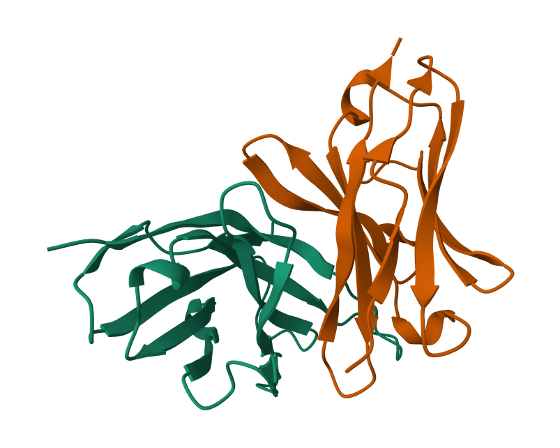

  
#  gradient-guided discrete Walk-Jump Sampling (gg-dWJS)

  

This repository is based on [discrete Walk-Jump Sampling](https://github.com/Genentech/walk-jump).

  

PyTorch implementation for our paper

  

[Antibody sequence optimization with gradient-guided discrete walk-jump sampling]().

  

Anonymous authors.

  

<!-- fig from assets -->


  

We train discriminators on the smoothed data manifold :pill: and use its gradient to guide the walk and the jump step in dWJS. We call our method gradient-guided discrete Walk-Jump Sampling (gg-dWJS) :feet: :walking: :running:

  

##  Setup

First, clone our repository.

```

cd ./gg-dWJS

```

Install [Anaconda](http://anaconda.org) environment in case not available. Run the following command next.

```

./scripts/install.sh

conda activate wj

```

  

##  Discrete MNIST task

<!-- mnist samples -->


###  Train

####  Denoise model

Change `data` in `train.yaml`

```

- data: mnist.yaml

```

Change `model_cfg/arch` in `denoise.yaml`

```

- model_cfg/arch: unet

```

To train the denoise model, run

```

walkjump_train

```

  

####  Discriminator model

First download the binarized MNIST dataset with labels from [Kaggle](https://www.kaggle.com/datasets/albertaillet/binarized-mnist-larochelle-et-al) and save it in `data/mnist_with_labels`.

  

Next, change `data`, `model` in `train.yaml`

```

- data: mnist_labels.yaml

- model: mnist_classifier.yaml

```

Change `model_cfg/arch` in `mnist_classifier.yaml`

```

- model_cfg/arch: convnet

```

To train the denoise model, run

```

walkjump_train

```

  

###  Sampling

To sample, first make the following changes to the `sample.yaml` file

```

guide_path: provide the checkpoint directory here

guidance: true

```

  

Then run

```

walkjump_sample

```

  

We also provide a script `plot.py` to easily visualize the generated MNIST images.

  

Finally use [PyTorch-FID](https://pypi.org/project/pytorch-fid/#:~:text=FID%20is%20a%20measure%20of,samples%20of%20Generative%20Adversarial%20Networks.) to calculate the FID between the samples.

  
  
  

##  Antibody task

```

QVQLQES-GPGLVKPSETLSLTCTVSG-GSIST-----YNWNWIRQSPGKGLEWIGEIYH----SGSTYYNPSLKSRVTLSVDTSKKQFSLKLTSVTAADTAIYYCARLGPYYSY--S------------SYSRGFDVWGRGTLVTVSSSYVLTQP-PSVSVSPGQTATLTCGLST--NLDN-----YHVHWYQQKPGQAPRTLIYR--------ADTRLSGVPERFSGSKSG--DTATLTITGVQAGDEGDYYCQLSDSG----------------------GSVVFGTGTKVTVL

```

<div  style="display: flex; justify-content: center;">





</div>

  

###  Train

####  Denoise model

Change `data` in `train.yaml`

```

- data: poas.yaml

```

Change `model_cfg/arch` in `denoise.yaml`

```

- model_cfg/arch: bytenet

```

To train the denoise model, run

```

walkjump_train

```

  

####  Discriminator model

Change `data`, `model` in `train.yaml`

```

- data: poas_labels_yaml

- model: ab_discriminator.yaml

```

Change `model_cfg/arch` in `ab_discriminator.yaml`

```

- model_cfg/arch: bytenet_mlp

```

To train the denoise model, run

```

walkjump_train

```

  

###  Sampling

To sample, first make the following changes to the `sample.yaml` file

```

guide_path: provide the checkpoint directory here

guidance: true

output_csv: provide the path here

```

  

Then run

```

walkjump_sample

```

###  Evaluation

####  % beta sheet and instability index

To evaluate % beta sheet and instability index, run the following script

```

python samples/eval_criteria.py --dir [directory of the CSV file]

```

Make sure to store the sample csv file accordingly.

  

####  Distributional conformity score (DCS)

To evaluate DCS, run the following script

```

python samples/eval_dcs.py --dir [directory of the CSV file]

```

## Data
Below are the directories to the datasets used in this work.
|Experiments|  Data |
|--|--|
| POAS experiment | data/poas_train_2.csv.gz |
| hu4D5 experiment| data/HER2.csv |
| MNIST experiment| data/binarized_mnist_[train/test/valid].amat |

  
## Checkpoints

Below are the directories to all the checkpoints trained and used in this work.
|  Checkpoint | Directory |
|--|--|
| POAS % beta sheet discriminator | checkpoints/ab_beta_perc_check |
| POAS instability index discriminator | checkpoints/ab_instability_index_check |
| POAS score model | checkpoints/poas_check |
|  POAS preference conditional discriminator | checkpoints/ab_singlevalue_ar_beta |
|hu4D5 classifier | checkpoints/her_classifier |
|hu4D5 score model | checkpoints/her_score |
|hu4D5 discriminator | checkpoints/her_noised_classifier |

##  Citations

If you use the code and/or model checkpoints, please cite:

```

Coming soon

```